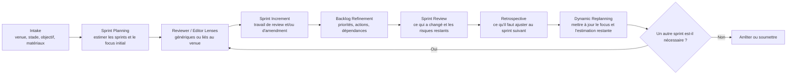

# Paper Sprint Review

[English](./README.md) | [简体中文](./README.zh-CN.md) | [Français](./README.fr.md)

Une skill Codex d'agent de rédaction scientifique inspirée de Scrum.

Cette skill transforme l'amélioration d'un article en boucle Scrum reproductible : clarifier la direction, estimer le nombre probable de sprints, exécuter un increment ciblé, transformer les critiques en backlog, réviser le manuscrit, faire une sprint review, ajuster le prochain point d'attention, puis recommencer si nécessaire.

<a id="quick-navigation-fr"></a>

## Navigation Rapide

- [Utiliser Cette Skill Maintenant](#use-now-fr)
- [Workflow](#workflow-fr)
- [Modèle De Prompt De Démarrage](#starter-prompt-fr)
- [Heuristiques D'Estimation Des Sprints](#sprint-estimates-fr)
- [Prompts Typiques](#typical-prompts-fr)
- [English](./README.md)
- [简体中文](./README.zh-CN.md)

<a id="who-this-is-for-fr"></a>

## Pour Qui

- Les doctorants qui transforment leur thèse en article
- Les auteurs qui préparent une soumission pour conférence ou revue
- Les auteurs en phase de revise-and-resubmit
- Les chercheurs qui veulent une critique structurée plutôt qu'une simple révision de style

<a id="use-now-fr"></a>

## Utiliser Cette Skill Maintenant

Copiez ce prompt dans une session Codex puis remplacez les champs :

```text
Use paper-sprint-review as a Scrum-inspired paper agent for my manuscript.
Target venue: [conference/journal or unknown]
Current stage: [idea/outline/early draft/full draft/revision/rebuttal/camera-ready]
Primary goal for this sprint: [contribution/theory/method/evidence/writing/venue fit/rebuttal]
Materials available: [file paths or sources]
Should you browse current venue/editor/profile information? [yes/no]
Please:
1. run intake,
2. estimate the likely number of sprints,
3. draft an initial sprint narrative with focus areas,
4. execute the first review or amendment increment,
5. end with a backlog, sprint review, and next-sprint recommendation.
```

Pour un démarrage rapide :

```text
Use paper-sprint-review to run intake and sprint 1 for my draft. Estimate sprint count first and focus on the highest-risk issue.
```

## Ce Que La Skill Fait

- Clarifier l'objectif de l'article, la revue ou la conférence visée, le stade du manuscrit et les matériaux disponibles.
- Estimer dès le départ le nombre probable de sprints et proposer une narration initiale des sprints au lieu d'improviser à chaque tour.
- Construire des reviewer et editor lenses ancrés dans le `venue fit` plutôt que dans un simple jeu de rôles.
- Exécuter des review increments qui produisent des critiques actionnables au lieu de commentaires vagues.
- Convertir les remarques en revision backlog avec priorités, dépendances et critères de validation.
- Conduire des amendment increments qui modifient directement le texte ou produisent des propositions de réécriture prêtes à appliquer.
- Maintenir un process log stable, ainsi qu'une sprint review et une retrospective, sur plusieurs itérations.

<a id="workflow-fr"></a>

## Workflow



<a id="starter-prompt-fr"></a>

## Modèle De Prompt De Démarrage

```text
Use paper-sprint-review as a Scrum-inspired paper agent for my manuscript.
Target venue: [conference/journal or unknown]
Current stage: [idea/outline/early draft/full draft/revision/rebuttal/camera-ready]
Primary goal for this sprint: [contribution/theory/method/evidence/writing/venue fit/rebuttal]
Materials available: [file paths or sources]
Should you browse current venue/editor/profile information? [yes/no]
Please:
1. run intake,
2. estimate the likely number of sprints,
3. draft an initial sprint narrative with focus areas,
4. execute the first review or amendment increment,
5. end with a backlog, sprint review, and next-sprint recommendation.
```

<a id="sprint-estimates-fr"></a>

## Heuristiques D'Estimation Des Sprints

| Stade du draft | Nombre probable de sprints | Focus par défaut |
| --- | --- | --- |
| idée ou plan | `4-6` | contribution, cadrage du problème, question de recherche, venue fit |
| premier draft complet | `3-5` | logique théorique, structure, crédibilité méthodologique |
| draft de soumission avancé | `2-4` | solidité des preuves, discussion, polish, conformité |
| revise and resubmit | `2-3` | cartographie des commentaires, réparation argumentative, stratégie de réponse |
| rebuttal ou camera-ready | `1-2` | corrections ciblées, traçabilité, préparation finale |

Ces estimations servent de point de départ, pas d'engagement fixe. La skill doit les réviser après chaque sprint review et retrospective.

## Évolution Du Focus Au Fil Des Sprints

| Phase | Attention principale |
| --- | --- |
| début | contribution, importance du problème, ancrage théorique, venue fit |
| milieu | rigueur méthodologique, qualité des preuves, crédibilité des résultats, logique de discussion |
| fin | économie d'écriture, titre et résumé, implications, formatage, conformité |
| phase de réponse | cartographie des commentaires, logique de response letter, modifications traçables du manuscrit |

Si un blocage critique apparaît tardivement, le sprint suivant doit revenir immédiatement sur ce risque au lieu de poursuivre un simple polish superficiel.

## Sorties Par Défaut

| Artifact | Rôle |
| --- | --- |
| `starter prompt template` | Lancer le workflow avec les bons champs de configuration |
| `sprint brief` | Aligner l'objectif, le périmètre et les hypothèses du sprint courant |
| `initial sprint map` | Estimer le nombre de sprints et la séquence initiale des focus |
| `reviewer and editor setup` | Définir les lenses utilisées dans ce sprint |
| `review memo` | Capturer les constats par reviewer et la synthèse |
| `decision note` | Enregistrer la décision de gate du moment |
| `revision backlog` | Transformer les critiques en actions concrètes |
| `amendment summary` | Montrer ce qui a changé et ce qui reste ouvert |
| `sprint review and retrospective` | Expliquer les progrès, les blocages et les changements de focus |
| `process log update` | Préserver la continuité entre les sprints |

<a id="typical-prompts-fr"></a>

## Prompts Typiques

```text
Use paper-sprint-review as a Scrum-inspired paper agent for my MISQ resubmission. The materials are draft.tex, reviewer-comments.md, and response-letter.md. Estimate sprint count first.
```

```text
Use paper-sprint-review to run sprint 1 for my conference draft. Focus on contribution, theory fit, and venue alignment. Browse official venue sources if needed.
```

```text
Use paper-sprint-review to convert the latest review memo into a backlog, run one amendment increment on the introduction and discussion, and finish with a retrospective.
```

## Pourquoi Les Utilisateurs Peuvent Le Trouver Et L'Utiliser Plus Vite

- La page d'accueil du dépôt propose maintenant des liens directs vers les sections clés ainsi que vers les versions chinoise et française.
- Le haut du README contient un prompt prêt à copier, donc l'utilisateur peut essayer la skill immédiatement.
- Le diagramme de workflow explique le modèle opératoire en un seul écran.
- Les heuristiques de sprint donnent dès le départ une idée du niveau d'effort et de la progression attendue.

## Structure Du Dépôt

```text
paper-sprint-review/
├── SKILL.md
└── agents/
    └── openai.yaml
```

## Fichiers De La Skill

- [`SKILL.md`](./SKILL.md) : workflow principal et règles d'exécution
- [`agents/openai.yaml`](./agents/openai.yaml) : nom d'affichage, description courte et prompt par défaut

## Notes De Conception

- Utiliser les matériaux locaux du manuscrit comme source principale de vérité.
- Vérifier depuis des sources primaires les personnes, venues, deadlines et politiques lorsqu'ils peuvent avoir changé.
- Préférer des reviewer lenses à des personas fictifs, sauf si des editors ou scholars nommés sont explicitement requis.
- Traiter chaque increment comme un travail petit, inspectable, avec un sprint goal clair, une review et une retrospective.
- Réestimer le nombre de sprints restants lorsque le profil de risque du manuscrit évolue.
