# PaperSprint


> Scrum-inspired paper agent skill for review, revision, and R&R.  
> 受 Scrum 启发、面向 review、revision 和 R&R 的论文智能体 Skill。  
> Skill d'agent de rédaction scientifique inspirée de Scrum pour la review, la revision et le R&R.

`PaperSprint` is now the repository name. The current skill package id remains `paper-sprint-review`.  
`PaperSprint` 现在也是仓库名；当前 skill package id 仍然是 `paper-sprint-review`。  
`PaperSprint` est maintenant le nom du dépôt ; l'identifiant actuel du package de skill reste `paper-sprint-review`.

> Important: a strong PaperSprint draft is not automatically submission-ready. A human author still needs to inspect, tune, verify claims and citations, and make the final submission decision.  
> 重要提示：即使经过 PaperSprint 打磨的稿子已经很强，也不代表可以立刻投递。作者本人仍然需要人工检查、调理、核对论点与引用，并亲自做最终投稿决定。  
> Important : même un bon draft produit avec PaperSprint n'est pas automatiquement prêt à être soumis. L'auteur doit encore le relire, l'ajuster, vérifier les affirmations et les citations, puis prendre lui-même la décision finale de soumission.

[English](#en) | [简体中文](#zh) | [Français](#fr) | [Visual Workflow](#workflow) | [Quick Start](#quick-start) | [Artifacts](#artifacts) | [Repository Files](#repo-files)

<a id="workflow"></a>

## Visual Workflow

```mermaid
flowchart LR
    A["Intake<br/>venue, stage, goal, materials"] --> B["Sprint Planning<br/>estimate sprint count and initial focus"]
    B --> C["Reviewer / Editor Lenses<br/>generic or venue-aware"]
    C --> D["Sprint Increment<br/>review and/or amendment work"]
    D --> E["Backlog Refinement<br/>priorities, actions, dependencies"]
    E --> F["Sprint Review<br/>what changed and what risk remains"]
    F --> G["Retrospective<br/>what to shift next sprint"]
    G --> H["Dynamic Replanning<br/>update focus and remaining sprint estimate"]
    H --> I{"Another sprint needed?"}
    I -->|"Yes"| C
    I -->|"No"| J["Human Final Tuning<br/>manual inspection and judgment"]
    J --> K["Submit or Hold"]

    classDef start fill:#ecfeff,stroke:#0891b2,color:#164e63;
    classDef core fill:#eff6ff,stroke:#2563eb,color:#1e3a8a;
    classDef adapt fill:#fef3c7,stroke:#d97706,color:#78350f;
    classDef finalStage fill:#ecfccb,stroke:#65a30d,color:#365314;
    classDef human fill:#fce7f3,stroke:#db2777,color:#831843;

    class A,B,C,D,E core;
    class F,G,H adapt;
    class I,K finalStage;
    class J human;
```



| Stage | Focus |
| --- | --- |
| Early | contribution, problem framing, research question, venue fit |
| Middle | theory grounding, method rigor, evidence quality, discussion logic |
| Late | writing compression, title and abstract, implications, formatting, compliance |
| R&R / rebuttal | comment mapping, response strategy, traceable manuscript changes |

| Release gate | Human final tuning before any submission decision |

<a id="quick-start"></a>

## Quick Start

<details open>
<summary><strong>English</strong></summary>

Use PaperSprint when you want structured paper review instead of generic editing.

```text
Use PaperSprint (paper-sprint-review) as a Scrum-inspired paper agent for my manuscript.
Target venue: [conference/journal or unknown]
Current stage: [idea/outline/early draft/full draft/revision/rebuttal/camera-ready]
Primary goal for this sprint: [contribution/theory/method/evidence/writing/venue fit/rebuttal]
Materials available: [file paths or sources]
Should you browse current venue/editor/profile information? [yes/no]
Please:
1. run intake,
2. estimate the likely number of sprints,
3. draft an initial sprint narrative with focus areas,
4. execute the first review or amendment increment,
5. end with a backlog, sprint review, and next-sprint recommendation.
```

Fast start:

```text
Use PaperSprint (paper-sprint-review) to run intake and sprint 1 for my draft. Estimate sprint count first and focus on the highest-risk issue.
```

Do not treat the final PaperSprint sprint as the automatic submission moment. Always finish with a human finalization pass.
</details>

<details>
<summary><strong>简体中文</strong></summary>

当你需要结构化论文评审，而不是泛泛润色时，使用 PaperSprint。

```text
请使用 PaperSprint（paper-sprint-review）作为我的 Scrum 风格论文智能体。
目标 venue：[conference/journal 或 unknown]
当前阶段：[idea/outline/early draft/full draft/revision/rebuttal/camera-ready]
本轮 sprint 主要目标：[contribution/theory/method/evidence/writing/venue fit/rebuttal]
现有材料：[文件路径或来源]
是否需要联网查看最新 venue/editor/profile 信息？[yes/no]
请：
1. 先做 intake，
2. 估算大致需要多少个 sprints，
3. 生成一个初始 sprint narrative 和 focus areas，
4. 执行第一轮 review 或 amendment increment，
5. 最后输出 backlog、sprint review 和下一轮建议。
```

快速启动：

```text
请使用 PaperSprint（paper-sprint-review）对我的 draft 做 intake 和 sprint 1。先估算 sprint 数量，再优先处理最高风险问题。
```

不要把最后一个 PaperSprint sprint 直接视为“可以投稿”。必须保留作者自己的人工最终调理环节。
</details>

<details>
<summary><strong>Français</strong></summary>

Utilisez PaperSprint si vous voulez une critique structurée de votre article plutôt qu'une simple correction de style.

```text
Utilise PaperSprint (paper-sprint-review) comme agent de rédaction scientifique inspiré de Scrum pour mon manuscrit.
Venue cible : [conference/journal ou unknown]
Stade actuel : [idea/outline/early draft/full draft/revision/rebuttal/camera-ready]
Objectif principal de ce sprint : [contribution/theory/method/evidence/writing/venue fit/rebuttal]
Matériaux disponibles : [chemins de fichiers ou sources]
Faut-il consulter en ligne les informations actuelles sur le venue, les editors ou les profils ? [yes/no]
Merci de :
1. faire l'intake,
2. estimer le nombre probable de sprints,
3. proposer une narration initiale des sprints et des focus areas,
4. exécuter le premier review ou amendment increment,
5. terminer avec un backlog, une sprint review et une recommandation pour le sprint suivant.
```

Démarrage rapide :

```text
Utilise PaperSprint (paper-sprint-review) pour faire l'intake et le sprint 1 de mon draft. Estime d'abord le nombre de sprints puis concentre-toi sur le risque le plus élevé.
```

Ne considérez pas le dernier sprint PaperSprint comme un feu vert automatique pour soumettre. Gardez toujours une phase finale de réglage humain.
</details>

<a id="en"></a>

## English

### Why PaperSprint

- Turn academic paper polishing into Scrum-style sprints.
- Estimate likely sprint count from the draft stage instead of improvising each round.
- Create a living sprint narrative that changes as manuscript risk changes.
- Produce actionable critique, backlog items, and next-sprint recommendations.
- Work well for submission prep, revise-and-resubmit, and thesis-to-paper conversion.

### Sprint Estimate Heuristics

| Draft stage | Likely sprint count | Default focus |
| --- | --- | --- |
| material-rich idea or outline | `12-18` | contribution, framing, research question, venue fit |
| early full draft | `8-14` | theory logic, structure, method credibility |
| mature submission draft | `5-9` | evidence strength, discussion, polish, compliance |
| revise and resubmit | `4-7` | comment mapping, argument repair, response strategy |
| rebuttal or camera-ready | `2-4` | targeted fixes, traceability, final readiness |

A path from a well-developed idea to a solid working draft can realistically take around `16` sprints.

<a id="zh"></a>

## 简体中文

### 为什么用 PaperSprint

- 把论文打磨转成 Scrum 式 sprint，而不是零散修改。
- 根据稿件阶段先估算 sprint 数量，而不是每一轮都临时判断。
- 形成会随着风险变化而更新的 sprint narrative。
- 输出可执行批评、revision backlog 和下一轮建议。
- 特别适合投稿准备、revise-and-resubmit 和 thesis-to-paper。

### Sprint 数量估算

| 文稿阶段 | 预估 sprint 数量 | 默认关注点 |
| --- | --- | --- |
| 材料较充分的想法或提纲 | `12-18` | contribution、问题 framing、研究问题、venue fit |
| 早期完整草稿 | `8-14` | 理论逻辑、结构、方法可信度 |
| 较成熟投稿稿 | `5-9` | 证据强度、讨论、润色、合规 |
| revise and resubmit | `4-7` | 评论映射、论证修复、回复策略 |
| rebuttal 或 camera-ready | `2-4` | 定向修补、可追踪性、最终提交准备 |

如果是“已有较充分材料的 idea”到“像样的工作稿”，大约 `16` 个 sprint 是完全现实的。

<a id="fr"></a>

## Français

### Pourquoi PaperSprint

- Transformer l'amélioration d'un article en sprints Scrum au lieu d'éditions dispersées.
- Estimer le nombre de sprints dès le départ selon le stade du manuscrit.
- Maintenir une narration de sprint vivante qui évolue avec le profil de risque du manuscrit.
- Produire des critiques actionnables, un revision backlog et une recommandation pour le sprint suivant.
- Très adapté à la préparation de soumission, au revise-and-resubmit et à la transformation thèse-vers-article.

### Heuristiques D'Estimation Des Sprints

| Stade du draft | Nombre probable de sprints | Focus par défaut |
| --- | --- | --- |
| idée ou plan déjà bien documenté | `12-18` | contribution, cadrage, question de recherche, venue fit |
| premier draft complet | `8-14` | logique théorique, structure, crédibilité méthodologique |
| draft de soumission avancé | `5-9` | solidité des preuves, discussion, polish, conformité |
| revise and resubmit | `4-7` | cartographie des commentaires, réparation argumentative, stratégie de réponse |
| rebuttal ou camera-ready | `2-4` | corrections ciblées, traçabilité, préparation finale |

Passer d'une idée déjà bien étayée à un draft de travail solide peut très raisonnablement demander environ `16` sprints.

<a id="artifacts"></a>

## Artifacts

| Artifact | Why it matters |
| --- | --- |
| `starter prompt template` | Launch the workflow with the right context |
| `sprint brief` | Align the current goal, scope, and assumptions |
| `initial sprint map` | Estimate sprint count and likely focus progression |
| `review memo` | Capture reviewer-specific findings and synthesis |
| `revision backlog` | Convert critique into prioritized next actions |
| `amendment summary` | Show what changed and what remains open |
| `sprint review and retrospective` | Explain progress, blockers, and focus shifts |
| `human finalization note` | Remind the author what must still be checked manually before submission |
| `process log update` | Preserve continuity across repeated sprints |

<a id="repo-files"></a>

## Repository Files

```text
PaperSprint/
├── README.md
├── LICENSE
├── SKILL.md
└── agents/
    └── openai.yaml
```

- [`SKILL.md`](./SKILL.md): core workflow and operating rules
- [`agents/openai.yaml`](./agents/openai.yaml): display name, short description, and default prompt
- [`LICENSE`](./LICENSE): MIT license
