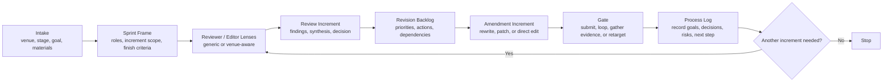

# Paper Sprint Review

Sprint-based academic paper review and revision for Codex.

This skill turns manuscript polishing into a repeatable loop: clarify the direction, run a focused review increment, convert critique into a backlog, amend the draft, record the decision, and repeat only as needed.

## What It Does

- Clarify the paper goal, target venue, draft stage, and available materials before starting work.
- Build reviewer and editor lenses that are grounded in venue fit rather than loose roleplay.
- Run review increments that produce actionable critique instead of generic feedback.
- Convert critique into a revision backlog with priorities, dependencies, and done criteria.
- Drive amendment increments that directly revise the draft or produce patch-ready rewrite instructions.
- Keep a stable process log across multiple review loops.

## Workflow



## Default Outputs

| Artifact | Purpose |
| --- | --- |
| `sprint brief` | Align the current goal, scope, and assumptions |
| `reviewer and editor setup` | Define the lenses used in this increment |
| `review memo` | Capture reviewer-specific findings and synthesis |
| `decision note` | Record the current gate outcome |
| `revision backlog` | Turn critique into concrete next actions |
| `amendment summary` | Show what changed and what remains open |
| `process log update` | Preserve continuity across increments |

## Typical Prompts

```text
Use paper-sprint-review to do intake for my MISQ resubmission. The materials are draft.tex, reviewer-comments.md, and response-letter.md.
```

```text
Use paper-sprint-review to run one review increment for my conference draft. Focus on contribution, theory fit, and venue alignment. Browse official venue sources if needed.
```

```text
Use paper-sprint-review to turn the latest review memo into a prioritized revision backlog and then execute one amendment increment on the introduction and discussion.
```

## Repository Structure

```text
paper-sprint-review/
├── SKILL.md
└── agents/
    └── openai.yaml
```

## Skill Files

- [`SKILL.md`](./SKILL.md): core workflow and operating rules
- [`agents/openai.yaml`](./agents/openai.yaml): display name, short description, and default prompt

## Design Notes

- Use local manuscript materials as the primary source of truth.
- Verify people, venue, deadline, and policy facts from primary sources when they may have changed.
- Prefer reviewer lenses over fictional personas unless named editors or scholars are explicitly needed.
- Treat each increment as small, inspectable work with a clear gate at the end.
