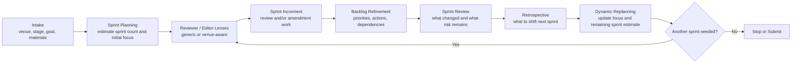

# Paper Sprint Review

[English](./README.md) | [简体中文](./README.zh-CN.md) | [Français](./README.fr.md)

A Scrum-inspired paper agent skill for Codex.

This skill turns manuscript polishing into a repeatable Scrum-style loop: clarify the direction, estimate the likely sprint path, run a focused increment, convert critique into a backlog, amend the draft, review the sprint, adjust the next focus, and repeat only as needed.

## What It Does

- Clarify the paper goal, target venue, draft stage, and available materials before starting work.
- Estimate the likely number of sprints and set an initial sprint narrative instead of improvising from round to round.
- Build reviewer and editor lenses that are grounded in venue fit rather than loose roleplay.
- Run review increments that produce actionable critique instead of generic feedback.
- Convert critique into a revision backlog with priorities, dependencies, and done criteria.
- Drive amendment increments that directly revise the draft or produce patch-ready rewrite instructions.
- Keep a stable process log, sprint review, and retrospective across multiple loops.

## Workflow



## Starter Prompt Template

```text
Use paper-sprint-review as a Scrum-inspired paper agent for my manuscript.
Target venue: [conference/journal or unknown]
Current stage: [idea/outline/early draft/full draft/revision/rebuttal/camera-ready]
Primary goal for this sprint: [contribution/theory/method/evidence/writing/venue fit/rebuttal]
Materials available: [file paths or sources]
Should you browse current venue/editor/profile information? [yes/no]
Please:
1. run intake,
2. estimate the likely number of sprints,
3. draft an initial sprint narrative with focus areas,
4. execute the first review or amendment increment,
5. end with a backlog, sprint review, and next-sprint recommendation.
```

## Sprint Estimate Heuristics

| Draft stage | Likely sprint count | Default focus |
| --- | --- | --- |
| idea or outline | `4-6` | contribution, framing, research question, venue fit |
| early full draft | `3-5` | theory logic, structure, method credibility |
| mature submission draft | `2-4` | evidence strength, discussion, polish, compliance |
| revise and resubmit | `2-3` | comment mapping, argument repair, response strategy |
| rebuttal or camera-ready | `1-2` | targeted fixes, traceability, final readiness |

These are starting estimates, not commitments. The skill should revise them after each sprint review and retrospective.

## How Focus Shifts Across Sprints

| Phase | Primary attention |
| --- | --- |
| early | contribution, problem importance, theory anchor, venue fit |
| middle | method rigor, evidence quality, results credibility, discussion logic |
| late | writing economy, title and abstract, implications, formatting, compliance |
| response round | reviewer comment mapping, response letter logic, traceable manuscript changes |

If a fatal blocker appears late, the next sprint should move back to that blocker instead of continuing superficial polish.

## Default Outputs

| Artifact | Purpose |
| --- | --- |
| `starter prompt template` | Kick off the workflow with the right setup fields |
| `sprint brief` | Align the current goal, scope, and assumptions |
| `initial sprint map` | Estimate sprint count and initial focus sequence |
| `reviewer and editor setup` | Define the lenses used in this increment |
| `review memo` | Capture reviewer-specific findings and synthesis |
| `decision note` | Record the current gate outcome |
| `revision backlog` | Turn critique into concrete next actions |
| `amendment summary` | Show what changed and what remains open |
| `sprint review and retrospective` | Explain progress, blockers, and focus shifts |
| `process log update` | Preserve continuity across increments |

## Typical Prompts

```text
Use paper-sprint-review as a Scrum-inspired paper agent for my MISQ resubmission. The materials are draft.tex, reviewer-comments.md, and response-letter.md. Estimate sprint count first.
```

```text
Use paper-sprint-review to run sprint 1 for my conference draft. Focus on contribution, theory fit, and venue alignment. Browse official venue sources if needed.
```

```text
Use paper-sprint-review to convert the latest review memo into a backlog, run one amendment increment on the introduction and discussion, and finish with a retrospective.
```

## Repository Structure

```text
paper-sprint-review/
├── SKILL.md
└── agents/
    └── openai.yaml
```

## Skill Files

- [`SKILL.md`](./SKILL.md): core workflow and operating rules
- [`agents/openai.yaml`](./agents/openai.yaml): display name, short description, and default prompt

## Design Notes

- Use local manuscript materials as the primary source of truth.
- Verify people, venue, deadline, and policy facts from primary sources when they may have changed.
- Prefer reviewer lenses over fictional personas unless named editors or scholars are explicitly needed.
- Treat each increment as small, inspectable work with a clear sprint goal, review, and retrospective.
- Re-estimate the remaining sprint count as the manuscript risk profile changes.
