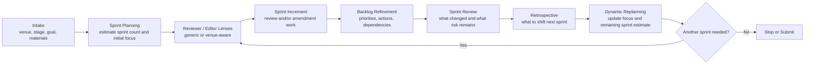

# Paper Sprint Review

[English](#en) | [简体中文](#zh) | [Français](#fr) | [Workflow](#workflow) | [Repository Files](#repo-files)

A Scrum-inspired paper agent skill for Codex.  
一个面向 Codex 的、受 Scrum 启发的论文智能体 Skill。  
Une skill Codex d'agent de rédaction scientifique inspirée de Scrum.

This skill turns paper revision into a repeatable sprint loop: intake, sprint planning, focused review or amendment, backlog refinement, sprint review, retrospective, and dynamic replanning.  
这个 Skill 把论文修改变成可重复的 sprint 循环：intake、sprint planning、聚焦 review 或 amendment、backlog refinement、sprint review、retrospective 和动态重规划。  
Cette skill transforme la révision d'un article en boucle de sprint reproductible : intake, sprint planning, review ou amendment ciblé, backlog refinement, sprint review, retrospective et replanning dynamique.

<a id="workflow"></a>

## Workflow



- English: Use the diagram as the default operating model for the skill.
- 中文：把这张图当作这个 Skill 的默认运行方式。
- Français : Utilisez ce diagramme comme modèle opératoire par défaut de la skill.

<a id="en"></a>

## English

### What It Does

- Turn academic paper polishing into Scrum-style sprints.
- Estimate likely sprint count based on the manuscript stage.
- Set an initial sprint narrative and shift focus as risk changes.
- Produce actionable critique instead of generic editing comments.
- Convert critique into a revision backlog with priorities and done criteria.
- End each sprint with a sprint review, retrospective, and next-sprint recommendation.

### Good Fit

- Thesis-to-paper conversion
- Conference or journal submission
- Revise-and-resubmit workflows
- Rebuttal or camera-ready polishing

### Use This Skill Now

```text
Use paper-sprint-review as a Scrum-inspired paper agent for my manuscript.
Target venue: [conference/journal or unknown]
Current stage: [idea/outline/early draft/full draft/revision/rebuttal/camera-ready]
Primary goal for this sprint: [contribution/theory/method/evidence/writing/venue fit/rebuttal]
Materials available: [file paths or sources]
Should you browse current venue/editor/profile information? [yes/no]
Please:
1. run intake,
2. estimate the likely number of sprints,
3. draft an initial sprint narrative with focus areas,
4. execute the first review or amendment increment,
5. end with a backlog, sprint review, and next-sprint recommendation.
```

Fast start:

```text
Use paper-sprint-review to run intake and sprint 1 for my draft. Estimate sprint count first and focus on the highest-risk issue.
```

### Sprint Estimate Heuristics

| Draft stage | Likely sprint count | Default focus |
| --- | --- | --- |
| idea or outline | `4-6` | contribution, framing, research question, venue fit |
| early full draft | `3-5` | theory logic, structure, method credibility |
| mature submission draft | `2-4` | evidence strength, discussion, polish, compliance |
| revise and resubmit | `2-3` | comment mapping, argument repair, response strategy |
| rebuttal or camera-ready | `1-2` | targeted fixes, traceability, final readiness |

### Default Outputs

- `starter prompt template`
- `sprint brief`
- `initial sprint map`
- `reviewer and editor setup`
- `review memo`
- `decision note`
- `revision backlog`
- `amendment summary`
- `sprint review and retrospective`
- `process log update`

<a id="zh"></a>

## 简体中文

### 这个 Skill 做什么

- 把学术论文打磨转成 Scrum 式 sprint 工作流。
- 根据稿件阶段先估算大致需要多少个 sprint。
- 先给出初始 sprint 叙事，再随着风险变化动态切换关注点。
- 输出可执行的批评意见，而不是泛泛的编辑建议。
- 把评论沉淀成带优先级和完成标准的 revision backlog。
- 每轮 sprint 结束时给出 sprint review、retrospective 和下一轮建议。

### 适用场景

- 博士论文转 paper
- 会议或期刊投稿打磨
- revise-and-resubmit
- rebuttal 或 camera-ready 定稿

### 立即使用

```text
请使用 paper-sprint-review 作为我的 Scrum 风格论文智能体。
目标 venue：[conference/journal 或 unknown]
当前阶段：[idea/outline/early draft/full draft/revision/rebuttal/camera-ready]
本轮 sprint 主要目标：[contribution/theory/method/evidence/writing/venue fit/rebuttal]
现有材料：[文件路径或来源]
是否需要联网查看最新 venue/editor/profile 信息？[yes/no]
请：
1. 先做 intake，
2. 估算大致需要多少个 sprints，
3. 生成一个初始 sprint narrative 和 focus areas，
4. 执行第一轮 review 或 amendment increment，
5. 最后输出 backlog、sprint review 和下一轮建议。
```

快速启动：

```text
请使用 paper-sprint-review 对我的 draft 做 intake 和 sprint 1。先估算 sprint 数量，再优先处理最高风险问题。
```

### Sprint 数量估算

| 文稿阶段 | 预估 sprint 数量 | 默认关注点 |
| --- | --- | --- |
| 想法或提纲 | `4-6` | contribution、问题 framing、研究问题、venue fit |
| 早期完整草稿 | `3-5` | 理论逻辑、结构、方法可信度 |
| 较成熟投稿稿 | `2-4` | 证据强度、讨论、润色、合规 |
| revise and resubmit | `2-3` | 评论映射、论证修复、回复策略 |
| rebuttal 或 camera-ready | `1-2` | 定向修补、可追踪性、最终提交准备 |

### 默认产物

- `starter prompt template`
- `sprint brief`
- `initial sprint map`
- `reviewer and editor setup`
- `review memo`
- `decision note`
- `revision backlog`
- `amendment summary`
- `sprint review and retrospective`
- `process log update`

<a id="fr"></a>

## Français

### Ce Que La Skill Fait

- Transformer l'amélioration d'un article académique en workflow Scrum par sprints.
- Estimer le nombre probable de sprints selon le stade du manuscrit.
- Définir une narration initiale des sprints puis déplacer le focus quand le risque change.
- Produire des critiques actionnables plutôt que des commentaires de forme génériques.
- Convertir les remarques en revision backlog avec priorités et critères de validation.
- Terminer chaque sprint par une sprint review, une retrospective et une recommandation pour le sprint suivant.

### Cas D'Usage

- Transformation thèse vers article
- Préparation d'une soumission pour conférence ou revue
- Workflows de revise-and-resubmit
- Rebuttal ou camera-ready

### Utiliser Cette Skill Maintenant

```text
Utilise paper-sprint-review comme agent de rédaction scientifique inspiré de Scrum pour mon manuscrit.
Venue cible : [conference/journal ou unknown]
Stade actuel : [idea/outline/early draft/full draft/revision/rebuttal/camera-ready]
Objectif principal de ce sprint : [contribution/theory/method/evidence/writing/venue fit/rebuttal]
Matériaux disponibles : [chemins de fichiers ou sources]
Faut-il consulter en ligne les informations actuelles sur le venue, les editors ou les profils ? [yes/no]
Merci de :
1. faire l'intake,
2. estimer le nombre probable de sprints,
3. proposer une narration initiale des sprints et des focus areas,
4. exécuter le premier review ou amendment increment,
5. terminer avec un backlog, une sprint review et une recommandation pour le sprint suivant.
```

Démarrage rapide :

```text
Utilise paper-sprint-review pour faire l'intake et le sprint 1 de mon draft. Estime d'abord le nombre de sprints puis concentre-toi sur le risque le plus élevé.
```

### Heuristiques D'Estimation Des Sprints

| Stade du draft | Nombre probable de sprints | Focus par défaut |
| --- | --- | --- |
| idée ou plan | `4-6` | contribution, cadrage, question de recherche, venue fit |
| premier draft complet | `3-5` | logique théorique, structure, crédibilité méthodologique |
| draft de soumission avancé | `2-4` | solidité des preuves, discussion, polish, conformité |
| revise and resubmit | `2-3` | cartographie des commentaires, réparation argumentative, stratégie de réponse |
| rebuttal ou camera-ready | `1-2` | corrections ciblées, traçabilité, préparation finale |

### Sorties Par Défaut

- `starter prompt template`
- `sprint brief`
- `initial sprint map`
- `reviewer and editor setup`
- `review memo`
- `decision note`
- `revision backlog`
- `amendment summary`
- `sprint review and retrospective`
- `process log update`

<a id="repo-files"></a>

## Repository Files

```text
paper-sprint-review/
├── README.md
├── LICENSE
├── SKILL.md
└── agents/
    └── openai.yaml
```

- [`SKILL.md`](./SKILL.md): core workflow and operating rules
- [`agents/openai.yaml`](./agents/openai.yaml): display name, short description, and default prompt
- [`LICENSE`](./LICENSE): MIT license
