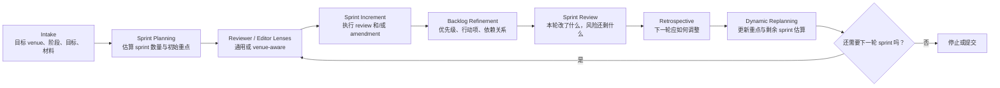

# Paper Sprint Review

[English](./README.md) | [简体中文](./README.zh-CN.md) | [Français](./README.fr.md)

一个面向 Codex 的、受 Scrum 启发的论文智能体 Skill。

这个 Skill 把论文打磨变成可重复的 Scrum 式循环：先澄清方向，估算大致需要多少个 sprint，再执行聚焦的 increment，把问题沉淀为 backlog，修改稿件，完成 sprint review，调整下一轮重点，然后按需继续推进。

<a id="quick-navigation-zh"></a>

## 快速导航

- [立即使用](#use-now-zh)
- [工作流](#workflow-zh)
- [启动 Prompt 模版](#starter-prompt-zh)
- [Sprint 数量估算](#sprint-estimates-zh)
- [典型 Prompt](#typical-prompts-zh)
- [English](./README.md)
- [Français](./README.fr.md)

<a id="who-this-is-for-zh"></a>

## 适合谁使用

- 想把博士论文材料转成论文的 PhD 学生
- 准备会议或期刊投稿的作者
- 正在处理 revise-and-resubmit 的作者
- 想要结构化批评而不是泛泛润色的研究者

<a id="use-now-zh"></a>

## 立即使用

把下面这段直接复制到 Codex 对话里，再替换占位符：

```text
Use paper-sprint-review as a Scrum-inspired paper agent for my manuscript.
Target venue: [conference/journal or unknown]
Current stage: [idea/outline/early draft/full draft/revision/rebuttal/camera-ready]
Primary goal for this sprint: [contribution/theory/method/evidence/writing/venue fit/rebuttal]
Materials available: [file paths or sources]
Should you browse current venue/editor/profile information? [yes/no]
Please:
1. run intake,
2. estimate the likely number of sprints,
3. draft an initial sprint narrative with focus areas,
4. execute the first review or amendment increment,
5. end with a backlog, sprint review, and next-sprint recommendation.
```

如果你只想快速启动第一轮，可以直接用：

```text
Use paper-sprint-review to run intake and sprint 1 for my draft. Estimate sprint count first and focus on the highest-risk issue.
```

## 它能做什么

- 在开始前澄清论文目标、目标期刊或会议、当前阶段以及已有材料。
- 先估算大致需要多少个 sprint，并给出初始 sprint 叙事，而不是每一轮都临时发挥。
- 根据 venue fit 构建 reviewer 和 editor lenses，而不是做松散的人格扮演。
- 执行能产出可操作批评意见的 review increment，而不是泛泛反馈。
- 把评论转成带优先级、依赖关系和完成标准的 revision backlog。
- 推进 amendment increment，直接改文稿或输出可直接套用的改写建议。
- 在多轮循环中保留稳定的 process log、sprint review 和 retrospective。

<a id="workflow-zh"></a>

## 工作流



<a id="starter-prompt-zh"></a>

## 启动 Prompt 模版

```text
Use paper-sprint-review as a Scrum-inspired paper agent for my manuscript.
Target venue: [conference/journal or unknown]
Current stage: [idea/outline/early draft/full draft/revision/rebuttal/camera-ready]
Primary goal for this sprint: [contribution/theory/method/evidence/writing/venue fit/rebuttal]
Materials available: [file paths or sources]
Should you browse current venue/editor/profile information? [yes/no]
Please:
1. run intake,
2. estimate the likely number of sprints,
3. draft an initial sprint narrative with focus areas,
4. execute the first review or amendment increment,
5. end with a backlog, sprint review, and next-sprint recommendation.
```

<a id="sprint-estimates-zh"></a>

## Sprint 数量估算

| 文稿阶段 | 预估 sprint 数量 | 默认关注点 |
| --- | --- | --- |
| 想法或提纲 | `4-6` | contribution、问题 framing、研究问题、venue fit |
| 早期完整草稿 | `3-5` | 理论逻辑、结构、方法可信度 |
| 较成熟的投稿稿 | `2-4` | 证据强度、讨论、润色、合规 |
| revise and resubmit | `2-3` | 评论映射、论证修复、回复策略 |
| rebuttal 或 camera-ready | `1-2` | 定向修补、可追踪性、最终提交准备 |

这些只是起始估算，不是刚性承诺。Skill 应该在每次 sprint review 和 retrospective 之后重新估算。

## Sprint 关注点如何变化

| 阶段 | 主要关注点 |
| --- | --- |
| 早期 | contribution、问题重要性、理论锚点、venue fit |
| 中期 | 方法严谨性、证据质量、结果可信度、讨论逻辑 |
| 后期 | 写作压缩、标题与摘要、理论与实践启示、格式与合规 |
| 回复评审阶段 | reviewer comment mapping、response letter 逻辑、可追踪的文稿修改 |

如果在后期暴露出致命问题，下一轮 sprint 应立刻回到该高风险问题，而不是继续做表层润色。

## 默认产物

| Artifact | 用途 |
| --- | --- |
| `starter prompt template` | 用正确的设置字段启动流程 |
| `sprint brief` | 对齐本轮目标、范围和前提假设 |
| `initial sprint map` | 估算 sprint 数量并给出初始重点序列 |
| `reviewer and editor setup` | 定义本轮使用的 lenses |
| `review memo` | 记录 reviewer 级别的发现和综合判断 |
| `decision note` | 记录当前 gate 决定 |
| `revision backlog` | 把批评意见转成具体后续动作 |
| `amendment summary` | 说明改了什么、还有什么未解决 |
| `sprint review and retrospective` | 总结进展、阻塞和重点迁移 |
| `process log update` | 在多轮 sprint 中保持连续记录 |

<a id="typical-prompts-zh"></a>

## 典型 Prompt

```text
Use paper-sprint-review as a Scrum-inspired paper agent for my MISQ resubmission. The materials are draft.tex, reviewer-comments.md, and response-letter.md. Estimate sprint count first.
```

```text
Use paper-sprint-review to run sprint 1 for my conference draft. Focus on contribution, theory fit, and venue alignment. Browse official venue sources if needed.
```

```text
Use paper-sprint-review to convert the latest review memo into a backlog, run one amendment increment on the introduction and discussion, and finish with a retrospective.
```

## 为什么用户能更快发现和使用它

- 仓库首页现在提供了到主要章节、中文和法语版本的直接跳转链接。
- README 顶部提供了可直接复制的 prompt，用户不需要先完整读懂 Skill 才能开始。
- 工作流图能在一屏内说明这个 Skill 的运行机制。
- sprint 估算规则让用户一开始就对投入成本和推进路径有概念。

## 仓库结构

```text
paper-sprint-review/
├── SKILL.md
└── agents/
    └── openai.yaml
```

## Skill 文件

- [`SKILL.md`](./SKILL.md)：核心工作流与执行规则
- [`agents/openai.yaml`](./agents/openai.yaml)：展示名、简短描述和默认 prompt

## 设计说明

- 以本地论文材料作为主要事实来源。
- 当人物、venue、deadline 或政策可能变化时，优先从一手来源核实。
- 除非明确需要命名 editor 或 scholar，否则优先使用 reviewer lenses，而不是虚构 persona。
- 每个 increment 都应足够小、可检查，并且有明确的 sprint goal、review 和 retrospective。
- 随着稿件风险结构变化，持续重估剩余 sprint 数量。
